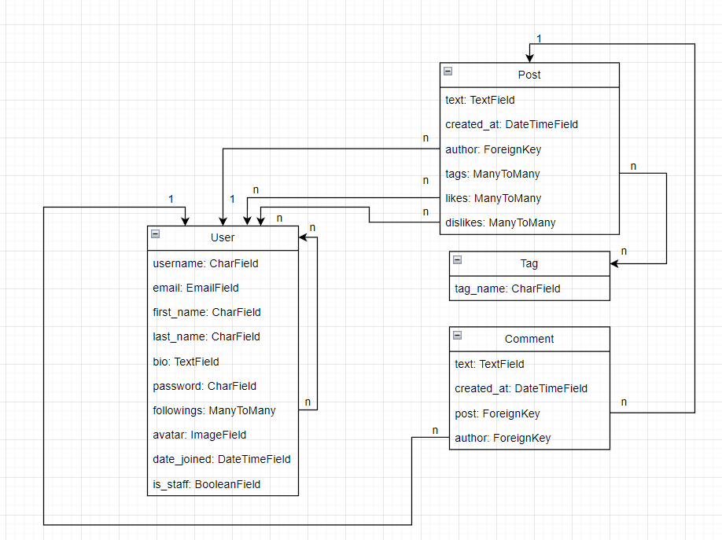

# RESTful API for social media with help DRF

## Features

- CRUD users
- Filter users by username/email
- Follow/Unfollow other users
- CRUD for posts with tags
- Filter posts by tags/author
- Like/Dislike for posts
- Comment posts

